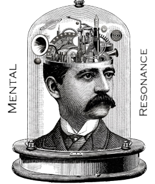
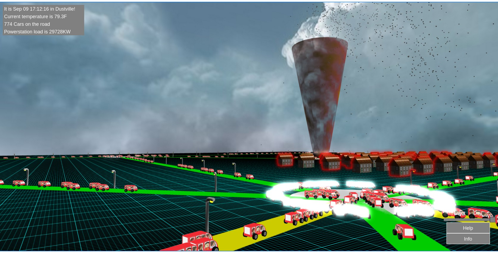

  

# Dust
The advent of (very) virtual threads in Java (Java 19 and up) enables modern Java to create  100,000's 
or millions of threads of execution in a single executable. However, by design the framework for managing these lightweight 
threads remains the same as when Java applications could support only far fewer numbers. 

Thus the problems of writing correct highly threaded programs remain and are magnified. 

We therefore have three options:
1. Do not take advantage of the possibility to exploit much larger numbers of threads.
2. Exploit the extra threads and continue to wrestle with problems of locks, race conditions etc etc in the usual way
3. Adopt a different paradigm for structuring programs which can take advantage of being able to use very 
large numbers of threads while avoiding many of the associated problems. 

Dust takes the third route, but does so using a 50 year old idea - that of Actors.

An Actor is a closed object whose only form of communication with the world outside of it is by 
exchanging messages with other Actors. Internally what an Actor does in response to specific messages is 
called its behavior, and an Actor may change its behavior in response to messages it has received. 
*Importantly* an Actor itself is single threaded and processes messages one at a time in the order in 
which they were received. 

The world outside of an Actor is usually populated with (possibly millions) of other Actors and 
application creation is the process of defining the behaviors of classes of Actors and the messages being passed 
between them.

Actors implementations are not new - the Erland and Elixir languages are Actor inspired languages which run on 
a virtual machine designed specifically to support the Actor paradigm, and Akka is another example of an Actor system
built on top of the JVM. Indeed Dust took some of its inspiration
from Akka's 'classic' Actors, so if you are familiar with Akka you should find Dust to be very easy 
to get to grips with.

## Idiomatic Dust
Building on the Actor concept, Dust extends it by providing support for simple but powerful idioms which naturally 'fall out' of 
the implementation. These include:
* Pipelines -- dynamically create chains or graphs of Actors which cooperate to solve more complex processing tasks
* ServiceManagers -- dynamically create pools of identical Actors to scale (or limit) processing
* Delegation models -- Actors dynamically funnel their messages to other, possibly more specialized Actors and then
regain control when specific events occur
* Reaping -- 'rolling up' information from large families of Actors
* Entities -- support for persistent Actors which model 'real world' objects and their relationships. 
Thus Dust directly supports ..
* Event-based digital twins - systems of Actors modelling 'real world' events and entities.

## Some applications
Dust (or its predecessor) has been used to create several diverse applications including:
* A cancer treatment recommendation platform which uses the dust-nlp library to ingest and structure medical records and 
integrate them with other source of information (clinical trials, journals etc).
* A business news monitoring platform. This watches and analyzes the content of 100s of news feeds and creates Actor-based 
twins of business entities and monitors trending events (mergers, product announcements, lawsuits etc) between them.
* A wifi monitoring platform. A network of Raspberry Pis hosted Actors created to twin wifi clients in their vicinity. 
These Actors 'roll up' information to server based Actors which twin the physical plant (e.g. wireless access points, rooms 
in a building) and using signal-strength based triangulation give a rough model of how many people are where (this was during peak Covid)
* 
Dustville (included in dust-core) - a toy digital twinning example which models a town with cars, charging stations,
houses, and a power station which has murmuration of starlings flocking around it (because, of course, we can). 
Of no practical use but a fun toy.

## License
Dust is licensed under the Apache 2.0 open source license.

## Libraries
The full (so far) Dust family of libraries comprises:
1. dust-core - this library. Full support for local and remote Actors and a lot of Dusty idioms
2. dust-http - support for integrating http and Actor message passing. (To be released soon)
3. dust-html - support for creating Actor pipelines that do html document processing ("")
4. dust-feeds - library for creating feeds of various kinds - RSS clients, Web crawlers, search engines (via SearxNG) ("")
5. dust-nlp - LLM and Spacey support via Actors which permit the creation of NLP pipelines ("")

## Getting started
1. Make sure you have Java 21 or greater and Gradle installed
2. git clone https://github.com/dust-ai-mr/dust-core.git
3. cd dust-core
4. ./gradlew clean
5. ./gradlew test
6. ./gradlew publishMavenLocal

## Examples
The dust-ville project - a simple example of digital twinning using Actors; in this case a simple town with homes, rechargeable electric vehicles on streets, a power station heating the homes and charging the cars and a flock of starlings soaring around the power station. The bird simulation alone creates over 8000 Actors.

The tests directory contains many tests of supported Dust Idioms and are a good introduction to Dust basics.

## Support / Applications Development
Contact alan@mentalresonance.com  
